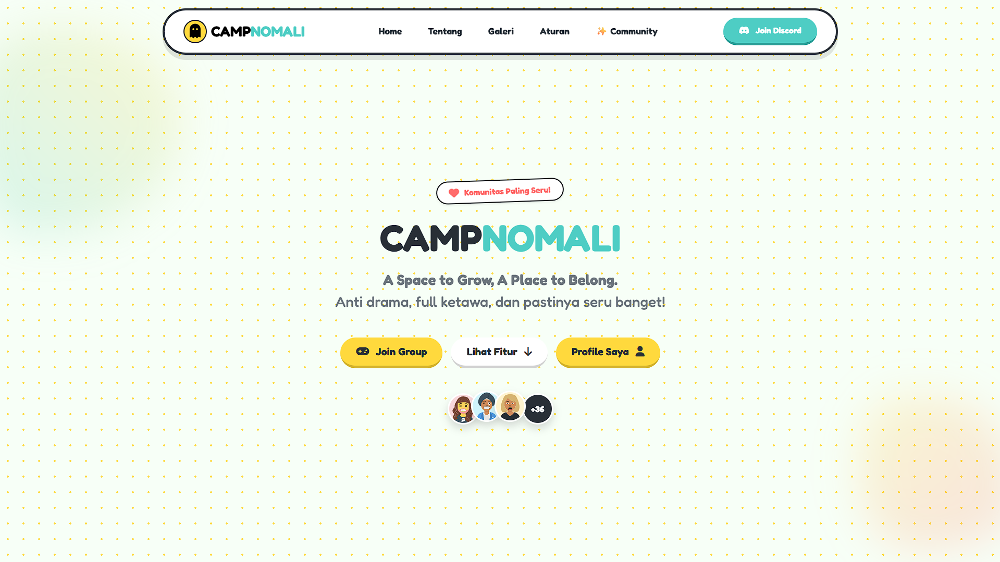

# Tugas Akhir Semester - Pemrograman Web 1

**Nama:** Aan Fadlilah
**NPM:** 1124100167
**Mata Kuliah:** Pemrograman Web 1
**Dosen:** EKO SISWANTO,S.Kom, M.Kom

---

# 👻 CAMPNOMALI Web Project

> **"A Space to Grow, A Place to Belong."**

Website ini adalah platform komunitas online yang dibangun untuk memenuhi Tugas Akhir Semester. Proyek ini mengimplementasikan desain web modern dengan gaya **"Toon"** yang interaktif, penuh warna, dan responsif.

## Preview Tampilan

Berikut adalah cuplikan tampilan antarmuka website CAMPNOMALI:


*Landing page dengan animasi blob & kartu*

## 🛠️ Teknologi Web
Project ini dibangun dengan **Stack Modern** tanpa framework berat:

*   **HTML5** - Struktur semantik halaman yang rapi.
*   **CSS3 (Vanilla + Custom Properties)** - Styling lanjutan dengan animasi, gradient, dan layouting flexbox.
*   **Bootstrap 5** - Framework CSS untuk grid system responsif dan komponen UI (Navbar, Modal).
*   **JavaScript (ES6+)** - Interaktivitas DOM, Event Listeners, dan Async Operations.
*   **Firebase Realtime Database** - Backend _Serverless_ untuk fitur penyimpanan data Postingan, Likes, dan Komentar secara real-time.
*   **External APIs** - Integrasi **DiceBear** (Avatar Generator) & **Discord Widget** (Member Stats).

## 📋 Fitur Unggulan
1.  **🎨 Desain "Toon" Estetik**
    *   Penggunaan warna cerah (Teal, Yellow, Red) dengan border tebal (Neubrutalism vibe).
    *   Efek hover "Bouncy" dan animasi rotasi acak pada kartu.
    *   Background animasi _blob_ yang dinamis.

2.  **📱 Fully Responsive**
    *   Tampilan menyesuaikan otomatis di Desktop, Tablet, dan HP.
    *   Navigasi mobile-friendly dengan menu hamburger custom.

3.  **💬 Sistem Komunitas Real-time**
    *   **Post Anonim**: User bisa posting status tanpa login rumit.
    *   **Live Interactions**: Fitur Like & Comment yang langsung muncul tanpa refresh halaman.
    *   **Smart Name Storage**: Menyimpan nama user di _LocalStorage_ agar tidak perlu ketik ulang.

4.  **🖼️ Galeri Interaktif**
    *   Lightbox Viewer untuk melihat foto ukuran penuh.
    *   Pagination otomatis saat dibuka di mode mobile.

## 📂 Struktur Folder
```
/ (Root)
│
├── index.html          # Halaman Utama (Landing Page)
├── README.md           # Dokumentasi Project
│
└── assets/
    ├── css/
    │   └── style.css   # Custom Styling (600+ baris code)
    │
    ├── js/
    │   └── script.js   # Main Logic (Firebase, UI, Events)
    │
    ├── img/            # Aset Gambar (Galeri, Ikon, dll)
    │
    └── [HTML Files]    # Halaman Pendukung (about, gallery, posting, rules)
```

<div align="center">

### 💻 Dibuat dengan penuh dedikasi oleh:

**Aan Fadlilah**
Teknik Informatika

*"Coding is not just about logic, it's about creating art that functions."*

&copy; 2025 - 2026 Campnomali Project. All Rights Reserved.

</div>


